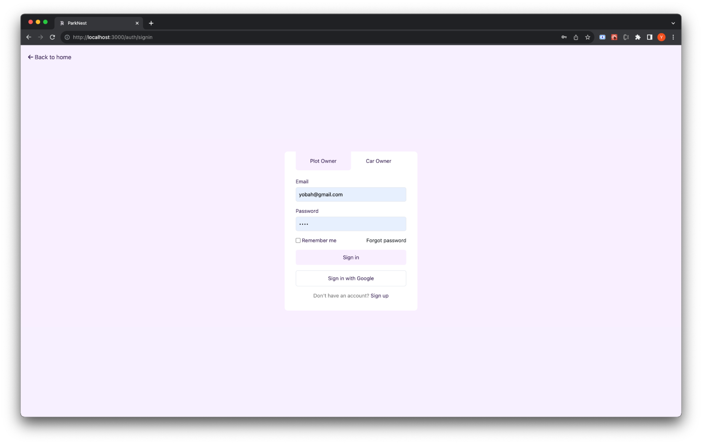

    

        
    

    

        
    

 

# CONTENTS

- [CONTENTS](#contents)
- [INTRODUCTION](#introduction)
  - [Overview of Project](#overview-of-project)
  - [Objectives of Project](#objectives-of-project)
  - [Benefits of Cloud Computing](#benefits-of-cloud-computing)
- [CLOUD COMPUTING](#cloud-computing)
  - [Characteristics](#characteristics)
  - [Type of Cloud (Deployment Model)](#type-of-cloud-deployment-model)
  - [Delivery Model](#delivery-model)
- [CLOUD COMPUTING COMPONENTS USED](#cloud-computing-components-used)
  - [Platforms](#platforms)
  - [Storage](#storage)
  - [Infrastructure](#infrastructure)
  - [Deployment](#deployment)
- [ARCHITECTURE](#architecture)
- [Module Design](#module-design)
  - [Authentication Module](#authentication-module)
    - [Plot Owner Sign-up and Log-in](#plot-owner-sign-up-and-log-in)
    - [Car Owner Sign-up and Log-in](#car-owner-sign-up-and-log-in)
    - [Google Log-in Provision: Simplified Authentication](#google-log-in-provision-simplified-authentication)
  - [Plot Registration Module](#plot-registration-module)
  - [Plot Booking Module](#plot-booking-module)
  - [Payment Portal](#payment-portal)
  - [Plot Listing](#plot-listing)
  - [User Profile](#user-profile)
  - [Deployment with Terraform](#deployment-with-terraform)
- [TOOLS USED](#tools-used)
- [RESULTS](#results)
    - [1. HOME PAGE](#1-home-page)
    - [2. AUTHENTICATION PAGE](#2-authentication-page)
    - [3. DASHBOARD](#3-dashboard)
        - [3.1 Plots - Plot Owner](#31-plots---plot-owner)
        - [3.2 Plots - Car Owner](#32-plots---car-owner)
    - [4. PAYMENT](#4-payment)
- [CONCLUSION](#conclusion)
- [BIBLIOGRAPHY](#bibliography)

---

# INTRODUCTION

## Overview of Project

The urban landscape of India is in the throes of a significant transformation, marked by exponential population growth and rapid urbanization. As the cities expand and infrastructure development takes precedence, one of the most pressing challenges facing car owners and commuters alike is the perpetual struggle to find suitable parking spaces. The burgeoning demand for parking is a concern of immense proportions, with forecasts indicating that by 2050, it could range from 7 to 23 times the size of the city of Mumbai (Urban Mobility India Conference, 2021). This problem has many different and significant effects, such as time wastage, traffic congestion, and an increasing psychological and financial burden on city people.

Our project, appropriately called "ParkNest," is the perfect example of how innovation, technology, and user-centric design can come together to solve the enduring parking problem seamlessly and effectively. The dynamic web application ParkNest was created with the single goal of assisting car owners and drivers in their search for a convenient and hassle-free parking experience. Through the application of modern technology and a user-focused methodology, we have developed a platform that serves as an interface between parking space providers and drivers who require a secure location for their vehicles.

ParkNest envisions a future where parking is not just a mere hassle but a managed and optimized service that brings some order to the chaos. The fundamental issue in many cities is that parking is either underpriced or overpriced, leading to either excessive congestion or vacant parking spaces. Our project recognizes the need for dynamic pricing strategies, accounting for factors like time of day and surrounding land use, to ensure optimal parking availability.

One of the unique features of ParkNest is its ability to seamlessly connect two distinct user groups - plot owners and car owners. Plot owners with underutilized spaces can list their available parking slots, indicating the number of cars they can accommodate and the corresponding fees per hour. On the other hand, vehicle owners can conveniently access these listings and select a parking spot that aligns with their destination, thereby transforming a previously arduous task into a straightforward and reliable process.

ParkNest has the potential to significantly impact the lives of car owners, commuters, and urban planners. It is not just a digital platform; it's a visionary response to the conundrum of parking in the evolving urban landscape of India. Our mission is to provide a seamless, reliable, and user-centric parking experience, and in doing so, reduce the emotional and economic toll associated with parking challenges.

## Objectives of Project

Our objective is to build an online platform that makes it easy to avail available parking spaces on rent from willing landlords while providing car owners with a user-friendly interface through which they can reserve parking spots based on their destination. Our goal is to reduce parking concerns when visiting relatives or friends.

## Benefits of Cloud Computing

The invention of cloud technology comes with a lot of benefits to individuals, businesses and even the government. The following are some benefits of cloud computing concerning our product ParkNest:

- **Scalability**: Cloud computing allows ParkNest to easily scale its infrastructure up or down based on demand. During peak hours, more resources can be quickly allocated to handle increased traffic, ensuring a smooth parking experience for customers.
- **Cost-effective**: The pay-as-you-go pricing models in the cloud would mean ParkNest only pays for the resources it uses. This eliminates the need for large upfront investments in hardware and reduces operational costs.
- **Global Accessibility**: With cloud hosting, ParkNest's services and data can be accessed from anywhere with an internet connection. This makes it convenient for customers to check parking availability and make payments in real time.
- **Security**: Leading cloud providers invest heavily in security measures. ParkNest can benefit from advanced security features, including encryption, access controls, and identity management to protect customer data.

Cloud computing enhances the scalability, security, and accessibility of the ParkNest project, improving the overall parking experience for customers while reducing operational costs.

---

# CLOUD COMPUTING

## Characteristics

- **Agility**: The cloud gives us easy access to a broad range of technologies so that we can innovate faster and build nearly anything that we can imagine.
- **Elasticity**: With cloud computing, we don’t have to over-provision resources upfront to handle peak levels of business activity in the future. Instead, we provision the amount of resources that we actually need.
- **Cost savings**: The cloud allows us to trade fixed expenses (such as data centers and physical servers) for variable expenses, and only pay for IT as we consume it.
- **Deploy globally in minutes**: With the cloud, we can expand to new geographic regions and deploy globally in minutes.

## Type of Cloud (Deployment Model)

- **Public Cloud**: In the public cloud model, cloud service providers like AWS, Azure, or Google Cloud make resources and services available to the general public over the Internet.
- **Private Cloud**: A single organization uses private cloud deployment and is typically hosted in its own data centers or through a third-party provider.
- **Hybrid Cloud**: A hybrid cloud combines both public and private cloud resources. It allows data and applications to be shared between them.
- **Community Cloud**: Community clouds are shared by several organizations with common concerns, such as compliance requirements or industry-specific standards.

## Delivery Model

- **Infrastructure as a Service (IaaS)**: IaaS contains the basic building blocks for cloud IT. It typically provides access to networking features, computers (virtual or on dedicated hardware), and data storage space.
- **Platform as a Service (PaaS)**: PaaS removes the need for you to manage underlying infrastructure (usually hardware and operating systems), and allows you to focus on the deployment and management of your applications.
- **Software as a Service (SaaS)**: SaaS provides you with a complete product that is run and managed by the service provider. In most cases, people referring to SaaS are referring to end-user applications (such as web-based email).

---

# CLOUD COMPUTING COMPONENTS USED

## Platforms

- **Razorpay**: We have added the Razorpay platform for easy and secure transactions with various modes such as UPI, cards and Netbanking.
- **GitHub**: Employed as a version control and collaboration platform for code development and project management.
- **AWS**: AWS is a cloud provider. We integrated Amazon Web Services (AWS) into a cloud computing project that involves creating an AWS account, defining project goals, and configuring Identity and Access Management (IAM).

## Storage

We used **Firebase Storage** and **Amazon Elastic Block Store (EBS)** in our cloud project. Firebase Storage, part of Google's Firebase platform, is suitable for hosting and serving files like images in web and mobile apps. On the other hand, Amazon EBS, part of Amazon Web Services (AWS), offers block storage volumes primarily used with EC2 instances.

We have used a **NoSQL database, MongoDB** to store user information, car details, plot details and booking records.

## Infrastructure

Parknest was deployed using multi-cloud, **Firebase** and **AWS**. On AWS, Parknest cloud infrastructure contains the following resources; EC2 instance, EBS, key pair, and security group. The EC2 instance was used to provision a virtual machine to host our application code and database. An EBS volume was attached to the EC2 instance to serve as a hard disk.

## Deployment

To deploy our project, we used **Terraform**. Terraform allows us to build, change, and version cloud resources. Using Terraform, we provisioned the AWS resources that are required for the successful execution of Parknest.

---

# ARCHITECTURE

ParkNest uses a three-tier architecture, that is, it has a presentation tier, a logic tier and a data tier. Below is a description of each layer and the tools used to implement the layer:

- **Presentation Layer**: This layer is a website that serves as an interface to ParkNest. This layer will be built with React JS to make it responsive and fast.
- **Logic Layer**: This layer will serve as middleware between the presentation layer and the database. The main application logic for storing, saving, booking and more will be part of this layer. This layer will be implemented using NextJS.
- **Data Layer**: This layer is responsible for storing data. Here, we will use MongoDB which is a NoSQL database.

---

# Module Design

## Authentication Module

For our "ParkNest" project, the authentication module plays a pivotal role in managing user access and sign-up processes for both plot owners and car owners. This module ensures the security and ease of authentication for the users by providing the following features:

### Plot Owner Sign-up and Log-in

- **Registration (Sign-up)**: Plot owners who wish to list their available parking spaces on the platform can register by providing their relevant information. This includes details like their name, contact information, and property information.
  
- **Log-in**: Registered plot owners can access their accounts by providing their username and password. This authentication step ensures that only authorized users can manage their parking listings.

### Car Owner Sign-up and Log-in

- **Registration (Sign-up)**: Car owners interested in booking parking spaces on "ParkNest" can create an account by providing essential information such as their name, contact details, and vehicle information.
  
- **Log-in**: After signing up, car owners can log in to their accounts using their registered username and password. This ensures that only authorized car owners can book parking spaces.

### Google Log-in Provision: Simplified Authentication

To enhance user convenience and streamline the log-in process, "ParkNest" offers the option for users to log in using their Google accounts. This feature allows users to skip the process of creating a separate account and remembering additional credentials. Instead, they can log in with their Google credentials, making the authentication process more user-friendly.

By incorporating these authentication features, "ParkNest" ensures a secure and user-friendly experience for both plot owners and car owners. It promotes trust and ease of use while also maintaining the security of user data and access to the platform.

## Plot Registration Module

This module allows plot owners to add and manage multiple plots that they are willing to rent out for parking. 

- **Add Plot**: From the dashboard menu, users click on "Plots"; the plots page contains a button for adding plots. This page also includes a table showing all the plots that the user is managing.
  
  - **Add Plot Page**: This page is responsible for taking in plot details, including plot name, number of medium-sized cars that can be parked, price per hour, plot location, parking rules (if any), plot description and instructions, and multiple photo uploads.

  - **Update Plot Details Page**: This will be similar to the add plot page but will allow the user to update the information.

  - **Delete Plot Popup**: This will warn the user about the risk of deleting a plot. If time permits, we will add an undo option.

- **Plot Management**: Each plot will contain options for updating and deleting the record. When the delete button is clicked, a prompt will appear warning the user about deleting. If the update or edit button is clicked, the user will be allowed to update the data.

## Plot Booking Module

From the plot listing page, the car owner enters their destination in the search box provided. When they hit search, a list of plots with available spots, ordered in terms of proximity to the actual destination, will be displayed below the map and recent activity section. 

- **Plot Details**: This page will display the plot name, owner’s name, a carousel of plot photos, plot description (if any), plot location, and a button for plot booking.

- **Checkout Pop-up**: Triggered by a click on the booking button on the plot details page. This page will contain the car owner’s destination, the parking plot destination, the price per hour, a drop-down menu to select the number of parking slots to be booked, a drop-down to select the desired parking duration, and a "Pay Now" button.

- **Razorpay Payment Portal**: From here, the entire process will be handled by Razorpay. After payment, the user will be redirected to the plot listing page.

## Payment Portal

The payment module opens the Razorpay payment portal where the user can pay using various options. After payment, the user is redirected to Google Maps with the correct location of the parking slot. A platform fee is deducted, and the remaining amount is sent to the slot owner.

## Plot Listing

This page is meant for car owners and allows them to search and scroll through plots. It will also contain the user’s recent bookings and a Google map plot and destination location.

- **List of Plots**: A list of plots which have available parking space.
  
- **Search Box**: Takes in the destination of the car owner and controls the list of plots accordingly. As the car owner types, a drop-down of suggestions will be displayed.

- **Recent Activities**: Contains recent plot bookings ordered by the date of booking with the most recent bookings appearing at the top. Clicking an expand button at the bottom of this section opens a popup with more history. A location button will be provided on the activity card which, when clicked, will open Google Maps redirecting the user to the plot’s location.

- **Google Map**: Shows the user’s destination and free spots within a given proximity.

- **Plot Card**: Shows the plot name, plot location, plot image, and plot price per hour. Clicking on any card opens the plot details page from which users can book parking slots.

## User Profile

For "ParkNest", the user profile module serves as a critical component that provides users, both plot owners and car owners, with a personalized and secure way to manage their information on the platform.

- **Plot Owner User Profile**: A dedicated portal that offers a comprehensive overview of their information and allows them to manage and update their details. This includes profile overview, editing profile information, and updating contact details.

Both plot owners and car owners can benefit from this "User Profile" module, as it empowers them to manage their personal information, monitor their parking space listings or bookings, and ensure that their account details are current and secure.

## Deployment with Terraform

The last module will be responsible for hosting the project on the AWS cloud using Docker and Terraform.

---

# TOOLS USED

- **Terraform**: This is an infrastructure as a code tool that will help us to provision resources required by our application on AWS.
- **ReactJS (NextJS)**: ReactJS will be used to build a user interface for our application. On the other hand, NextJS will be used to build the backend for our application.
- **Firebase Hosting**: Firebase Hosting provides fast and secure web hosting for our application, content and microservices.
- **Postman**: Postman is an API platform for building and using APIs. We used Postman to ensure that our APIs are working as expected.
- **JWT**: JWT stands for JSON Web Tokens. JWT is used to securely transmit information between two parties (client and server) in the form of a JSON object.
- **Google Maps API**: Google Maps API allows the integration of a map-based interface, enabling users to locate parking spots visually and get directions.

---
# RESULTS

##### 1. HOME PAGE

##### 2. AUTHENTICATION PAGE

##### 3. DASHBOARD

##### 3.1 Plots - Plot Owner

##### 3.2 Plots - Car Owner

##### 4. PAYMENT

## CONCLUSION

Our "PARKNEST" project significantly contributes to addressing the common urban problem of parking scarcity. In an ever-growing city like Bangalore, the shortage of available parking spaces has become a major concern for car owners. Our web-based application aims to provide an innovative solution to this issue. By creating a platform that connects willing plot owners with car owners seeking parking spaces, we have taken a step towards enhancing convenience and efficiency in urban mobility.

Our project successfully utilized cloud computing and various components to build and deploy this application. This approach offers several benefits, including scalability, cost-efficiency, and reliability, which are crucial for ensuring the smooth functioning of a service like "PARKNEST." Our cloud infrastructure, including the use of AWS and Terraform, demonstrates our commitment to modern technologies that can support our application's growth.

The three-tier architecture we employed, consisting of a presentation layer, a logic layer, and a data layer, is well-suited for managing the complexity of our application. By using ReactJS and NextJS for our frontend and backend development, respectively, we have ensured a responsive and user-friendly experience for both plot owners and car owners.

The modules we designed, including authentication, plot registration, plot booking, payment processing, and user profiles, are well-structured and aligned with the objectives of our project. The incorporation of a payment gateway through Razorpay adds convenience for users while ensuring secure transactions.

Our choice of technologies, such as MongoDB for data storage, showcases a modern and practical approach to application development.

In conclusion, "PARKNEST" is a promising project that effectively addresses a common urban issue by leveraging cloud computing and a well-thought-out architecture to create a user-friendly and efficient platform for connecting plot owners with car owners.

## BIBLIOGRAPHY

- AWS EC2 documentation (Accessed 07/11/2023) [AWS EC2](https://docs.aws.amazon.com/ec2/)
- AWS Cloud Security documentation (Accessed 07/11/2023) [AWS Cloud Security](https://aws.amazon.com/security/)
- Introduction official website (Accessed 25/07/2023) [Terraform Introduction](https://developer.hashicorp.com/terraform/intro)
- Terraform Architecture (Accessed 25/07/2023) [Terraform Architecture](https://spacelift.io/blog/terraform-architecture)
- Terraform Configuration (Accessed 25/07/2023) [Terraform Configuration](https://developer.hashicorp.com/terraform/language)
- Terraform CLI (Accessed 25/07/2023) [Terraform CLI](https://developer.hashicorp.com/terraform/cli/commands)
- Terraform providers (Accessed 25/07/2023) [Terraform Providers](https://registry.terraform.io/browse/providers)
- Terraform modules (Accessed 25/07/2023) [Terraform Modules](https://registry.terraform.io/browse/modules)
